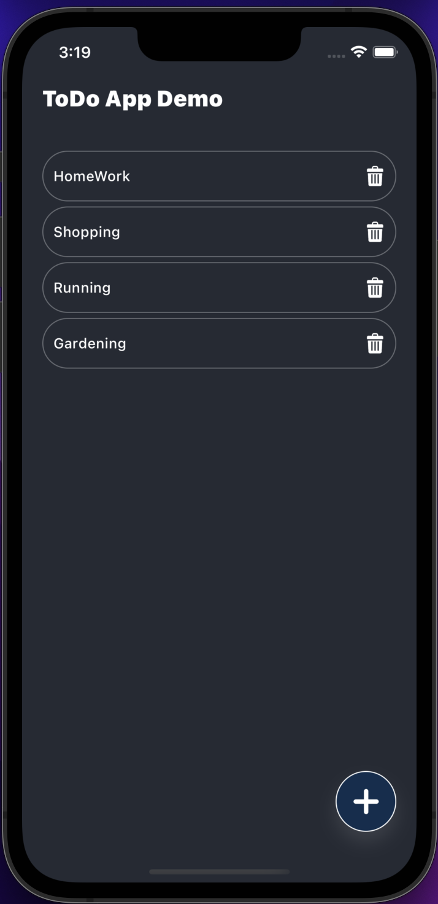
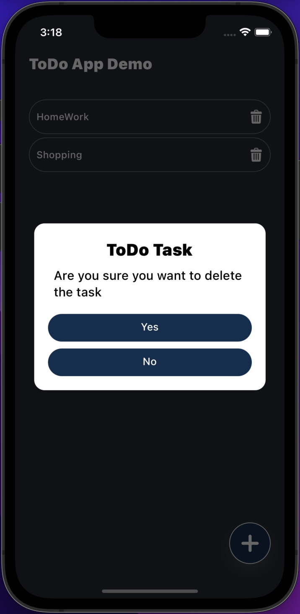
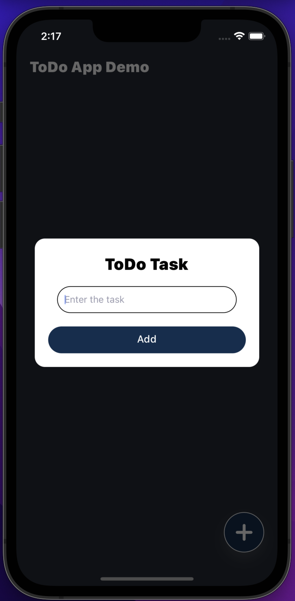
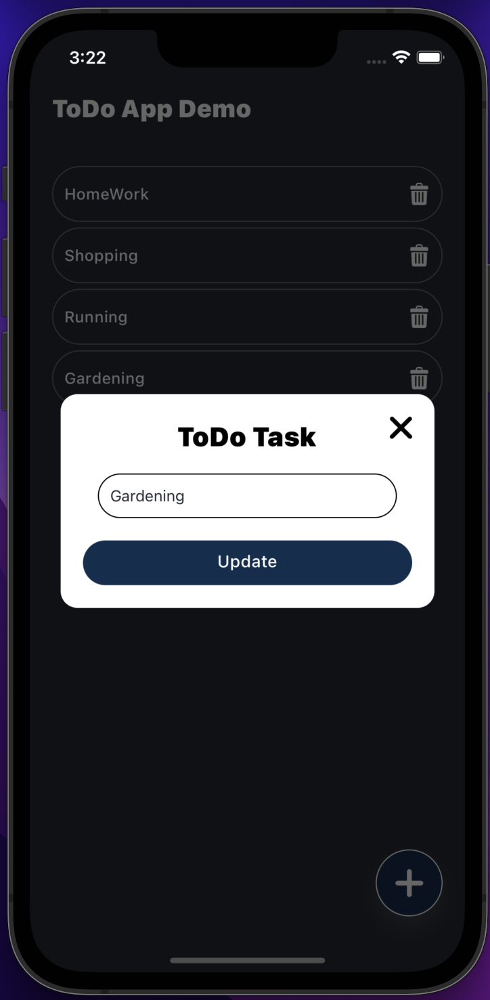

# ToDoList Demo

Based on:

- [React 17](https://reactjs.org)
- [React Native 0.65](https://reactnative.dev)
- [Redux](https://redux.js.org)
- [Realm Database](https://www.mongodb.com/docs/realm/sdk/react-native/)

## Getting started

- Install [yarn](https://classic.yarnpkg.com/en/docs/install): `npm i -g yarn`
- Install dependencies: `yarn`
- iOS-specific:
  - update pod files `cd ios && pod update`
  - move back and run `npx react-native run-ios`

## Running

- IOS Simulator - `npx react-native run-ios`
- Android Simulator - `npx react-native run-android`

## Screen Shot

### TaskListScreen

- This image show the task list.
- List of all the task added in the local database

### Delete Dialog

- This image show the dialog in case of task delete.
- 2 button yes and no. Yes will delete the task and no will hide the dialog

### Add Dialog

- This image show the dialog in case you want to add a task.
- 1 input text to write a task and and save button to save the task.

### Update Dialog

- This image show the dialog in case you want to edit or update a task.
- 1 input text in which per written text in it which you cant to modify.
- Update button to update the task.

